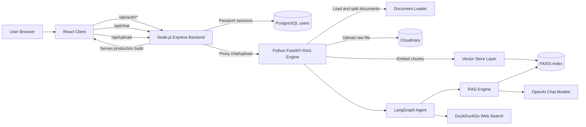
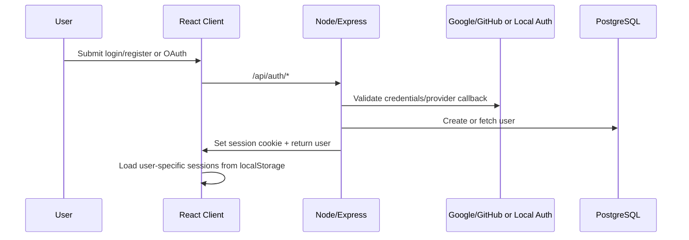
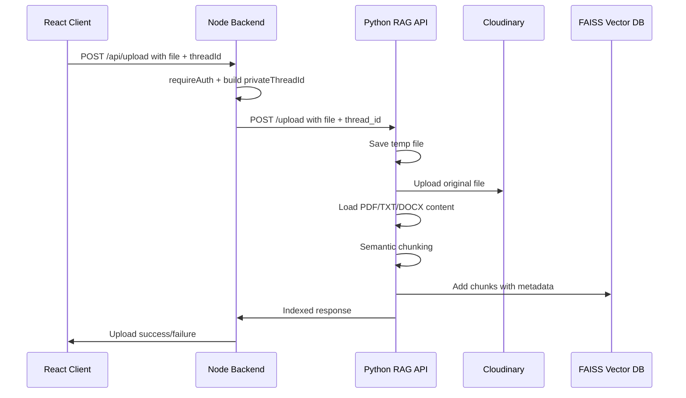
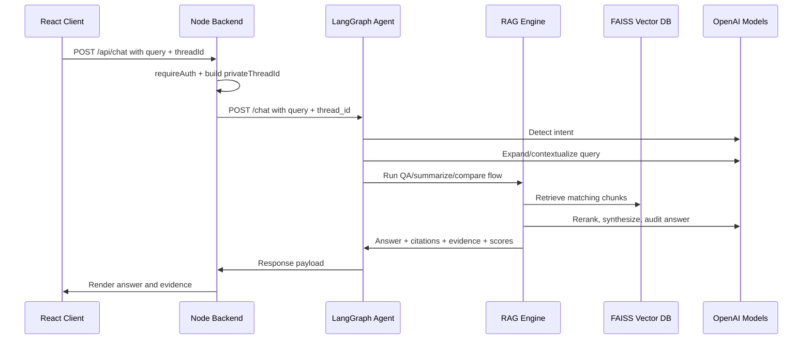
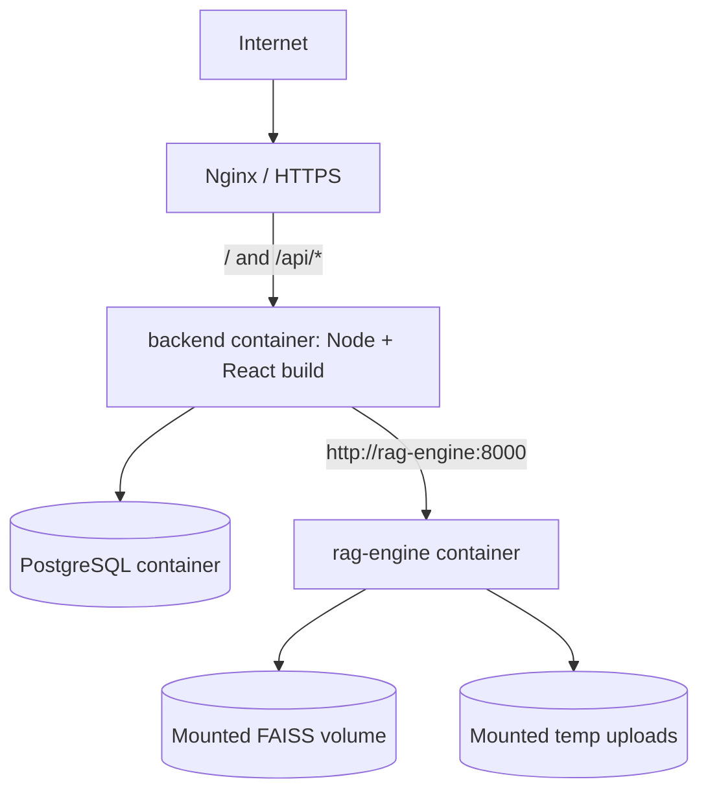

# System Design Architecture

This document explains the AI Research Assistant architecture the way a senior developer would walk a junior developer through it: start from the user journey, identify the system boundaries, then drill into the critical flows and tradeoffs.

## 1. Big Picture

The product is a document-grounded research assistant. Users log in, create research sessions, upload documents, and ask questions. The system stores document chunks in a FAISS vector index and uses an agentic RAG pipeline to retrieve, verify, and synthesize answers with evidence.

At a high level, there are four runtime layers:

| Layer            | Main Responsibility                                                                 | Code Location                                     |
| ---------------- | ----------------------------------------------------------------------------------- | ------------------------------------------------- |
| React client     | Chat UI, auth screens, session state, uploads, answer display                       | `client/`                                       |
| Node backend     | Auth, sessions, PostgreSQL users, upload proxy, chat proxy, static frontend serving | `server/src/index.ts`                           |
| Python RAG API   | Document ingestion, vector indexing, LangGraph/RAG execution                        | `rag_api.py`, `agent.py`, `rag_engine.py`   |
| Storage/services | Users, vector index, original file URLs, external LLM/search APIs                   | PostgreSQL, FAISS, Cloudinary, OpenAI, DuckDuckGo |

## 2. Architecture Diagram



Senior note: keep the Node backend as the product/API gateway and the Python service as the AI engine. Do not mix authentication and session ownership into the Python RAG service unless there is a deliberate platform reason.

## 3. Runtime Request Flow

### 3.1 Login Flow



Important details:

- The browser talks to Node for auth.
- Node uses Passport for local, Google, and GitHub authentication.
- User records live in PostgreSQL.
- Browser session history currently lives in `localStorage`, scoped by user id.
- The session cookie is `research_iq.sid`.

### 3.2 Document Upload Flow



The most important metadata added to chunks:

| Metadata      | Why It Matters                                  |
| ------------- | ----------------------------------------------- |
| `thread_id` | Keeps retrieval scoped to a research session    |
| `user_id`   | Supports user-level isolation and data deletion |
| `source`    | Allows citations and source grouping            |
| `page`      | Allows page-level evidence display              |
| `file_url`  | Lets the UI link back to the original document  |

Senior note: metadata is the security boundary for retrieval. If thread/user filters are wrong, users may retrieve each other's indexed chunks even if app login works.

### 3.3 Chat Flow



The response shape is designed for transparent RAG:

| Field            | Purpose                                         |
| ---------------- | ----------------------------------------------- |
| `response`     | Final answer shown to the user                  |
| `confidence`   | Combined quality signal                         |
| `faithfulness` | How grounded the answer is in retrieved context |
| `relevancy`    | How well the answer addresses the query         |
| `citations`    | Source files and pages                          |
| `evidence`     | Top chunks displayed in the UI                  |

## 4. Component Responsibilities

### React Client

Main file: `client/src/App.tsx`

Responsibilities:

- Shows auth UI or the research workspace.
- Maintains chat sessions in browser state and `localStorage`.
- Sends chat requests to `/api/chat`.
- Sends document uploads to `/api/upload`.
- Displays answer, evidence, quality scores, and upload/export state.

The client should not:

- Call the Python service directly.
- Own authentication decisions.
- Trust itself to isolate user data.

### Node Backend

Main file: `server/src/index.ts`

Responsibilities:

- Serves the built React app in production.
- Handles CORS and secure cookies.
- Owns authentication and session lifecycle.
- Stores users in PostgreSQL.
- Builds a private thread id using `userId:threadId`.
- Proxies chat and upload requests to Python.

This is the public backend boundary. Any browser-facing API should normally enter here first.

### Python RAG API

Main files: `rag_api.py`, `agent.py`, `rag_engine.py`

Responsibilities:

- Accepts chat and upload calls from Node.
- Loads documents and extracts text.
- Creates semantic chunks.
- Updates and loads the FAISS index.
- Runs the LangGraph intent and routing flow.
- Performs retrieval, reranking, synthesis, and self-evaluation.

There are currently two Python API-style files:

| File           | Role                                                                |
| -------------- | ------------------------------------------------------------------- |
| `rag_api.py` | FastAPI service used by the Node backend in Docker/local proxy flow |
| `main.py`    | Older/all-in-one FastAPI service with auth and RAG endpoints        |

Senior note: prefer one production API boundary. Keeping both `main.py` and `rag_api.py` can confuse deployment, docs, and debugging unless their roles are made explicit.

### Vector Store Layer

Main file: `vector_store.py`

Responsibilities:

- Uses `all-MiniLM-L6-v2` embeddings.
- Splits documents with `SemanticChunker`.
- Saves and loads local FAISS index files under `faiss_db/`.
- Adds metadata for user/session/source isolation.
- Performs best-effort user data clearing by rebuilding the index.

Senior note: FAISS is fast and simple, but local FAISS is not ideal for multi-user production deletion, concurrency, or large-scale metadata filtering. If usage grows, consider pgvector, Qdrant, Weaviate, Pinecone, or Milvus.

## 5. Data Ownership

| Data                   | Owner        | Persistence             |
| ---------------------- | ------------ | ----------------------- |
| User account           | Node backend | PostgreSQL              |
| Browser chat sessions  | React client | `localStorage`        |
| Uploaded original file | Python API   | Cloudinary              |
| Extracted chunks       | Python API   | FAISS local index       |
| Chunk metadata         | Python API   | FAISS docstore          |
| Auth session           | Node backend | Cookie + server session |
| LLM reasoning output   | Python API   | Returned to Node/client |

Senior note: chat history is currently client-side. That keeps the backend simpler, but it means chat history is device-local and can be lost when local storage is cleared.

## 6. Deployment Architecture

Production uses Docker Compose:



Relevant production ports:

| Service           | Container Port |     Host Port |
| ----------------- | -------------: | ------------: |
| Node backend      |       `5000` |      `5001` |
| Python RAG engine |       `8000` |      `8001` |
| PostgreSQL        |       `5432` | Internal only |

Deployment config:

- `deployment/docker-compose.yml`
- `Dockerfile.python`
- `server/Dockerfile.node`
- `.github/workflows/deploy.yml`

## 7. Key Design Decisions

### Why Node + Python?

Node is used for web-product concerns: sessions, OAuth, cookies, static frontend serving, and request proxying.

Python is used for AI concerns: LangChain, LangGraph, document loading, embeddings, FAISS, and model orchestration.

This split is reasonable because the libraries and operational concerns are different.

### Why Private Thread IDs?

The browser sends a simple session id. Node transforms it into:

```text
userId:threadId
```

This prevents two users with the same local session id from sharing retrieval scope.

### Why Store Original Files in Cloudinary?

FAISS only stores chunks and metadata. Cloudinary keeps the original uploaded file available for citation links and future inspection.

### Why Quality Scores?

The system returns faithfulness and relevancy so the UI can expose whether an answer appears grounded and useful, instead of treating every LLM answer as equally reliable.

## 8. Failure Points and How to Debug

| Symptom                      | Likely Layer       | First Check                                                     |
| ---------------------------- | ------------------ | --------------------------------------------------------------- |
| Login fails                  | Node/auth          | `SESSION_SECRET`, OAuth callback URLs, PostgreSQL connection  |
| Chat says RAG unavailable    | Node to Python     | `PYTHON_API_URL`, Python container logs, `/health` or `/` |
| Upload fails                 | Python ingestion   | Cloudinary env vars, temp directory, file parser support        |
| Answers ignore uploaded docs | Retrieval          | Confirm `thread_id` metadata and private thread id match      |
| Citations missing            | RAG metadata       | Check `source`, `page`, and `file_url` metadata on chunks |
| User sees wrong docs         | Security/retrieval | Audit `user_id` and `thread_id` filters immediately         |
| Production deploy fails      | Infra              | Docker disk usage, image build logs, env file presence          |

## 9. Current Architecture Gaps

These are not blockers, but they are the areas a senior developer would track before scaling:

1. `main.py` and `rag_api.py` overlap. Pick a single production FastAPI entry point.
2. Node `/api/auth/clear-data` currently returns success without calling Python to delete vectors.
3. Browser chat sessions are not persisted server-side.
4. Local FAISS can become difficult with concurrent writes and user-specific deletion.
5. Some RAG code uses broad exception handling, which can hide parsing or model errors.
6. The frontend sends `history` to Node, but the current Node proxy only forwards `query` and `thread_id` to `rag_api.py`.
7. Secrets and production settings should be audited before public deployment.

## 10. How to Explain This to a Junior Developer

Think of the app as three cooperating systems:

1. The frontend is the user's desk.
   It shows sessions, lets the user upload files, and displays answers.
2. The Node backend is the front office.
   It checks who the user is, keeps sessions safe, and forwards approved work to the AI engine.
3. The Python RAG engine is the research department.
   It reads documents, indexes them, searches the right evidence, asks the LLM to reason over that evidence, and returns an answer with proof.

The most important rule: every document chunk must remain tied to the right user and research thread. Most bugs in a RAG product are not model bugs; they are boundary bugs, metadata bugs, or retrieval-scope bugs.
