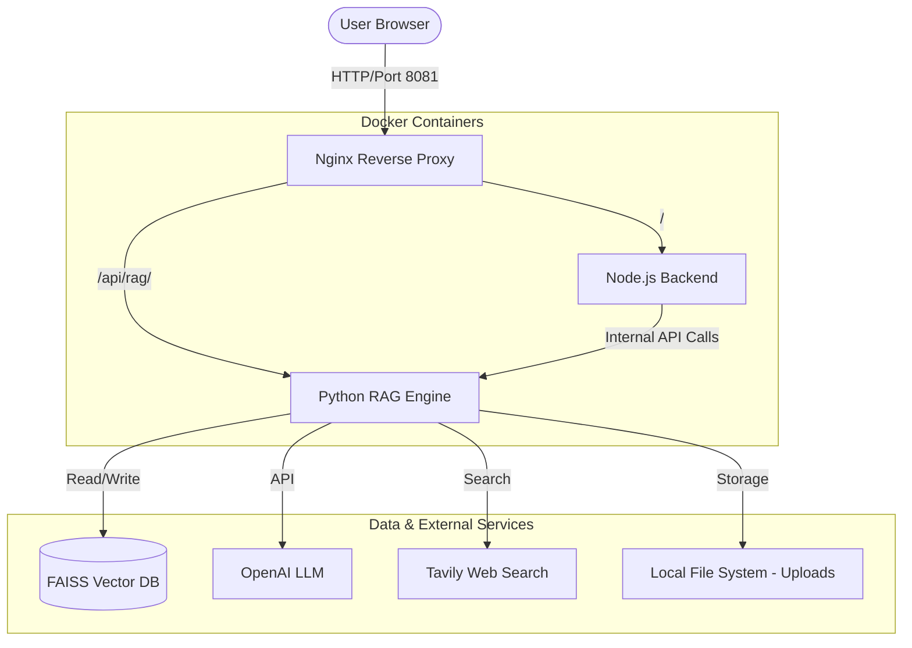

# System Architecture: Agentic RAG System

The AI Research Assistant is a multi-tier application designed for high-performance retrieval-augmented generation. It leverages a microservices-inspired architecture using Docker containers.

## High-Level Architecture Diagram

## Component Breakdown

### 1. Nginx Reverse Proxy

- **Role**: Entry point for all external traffic.
- **Port**: Listens on `8081`.
- **Function**:
  - Routes root requests (`/`) to the Node.js backend.
  - Routes `/api/rag/` requests to the Python RAG engine.
  - Handles `client_max_body_size` (50MB) to allow large PDF uploads.
  - Provides a layer of security and load balancing potential.

### 2. Node.js Backend (Express + TypeScript)

- **Role**: Orchestration and User Management.
- **Port**: `5001` (external), `5000` (internal).
- **Function**:
  - Serves the React/Vite frontend (static files).
  - Manages session state and file upload routing.
  - Proxies complex research requests to the Python engine.

### 3. Python RAG Engine (FastAPI + LangGraph)

- **Role**: Intelligence and Retrieval.
- **Port**: `8001` (external), `8000` (internal).
- **Function**:
  - **Document Loading**: Processes PDF/Text files.
  - **Vector Storage**: Manages FAISS indices for semantic search.
  - **Agentic Routing**: Uses LangGraph to decide whether to use local knowledge or perform a web search (Tavily).
  - **LLM Integration**: Communicates with OpenAI to generate responses based on retrieved context.

## Data Flow

1. **Upload**: User uploads a file through the UI -> Node.js Backend -> Python Engine -> FAISS Index.
2. **Query**: User asks a question -> Node.js Backend -> Python Engine -> LangGraph Agent -> Vector Search/Web Search -> LLM -> Response back to User.
